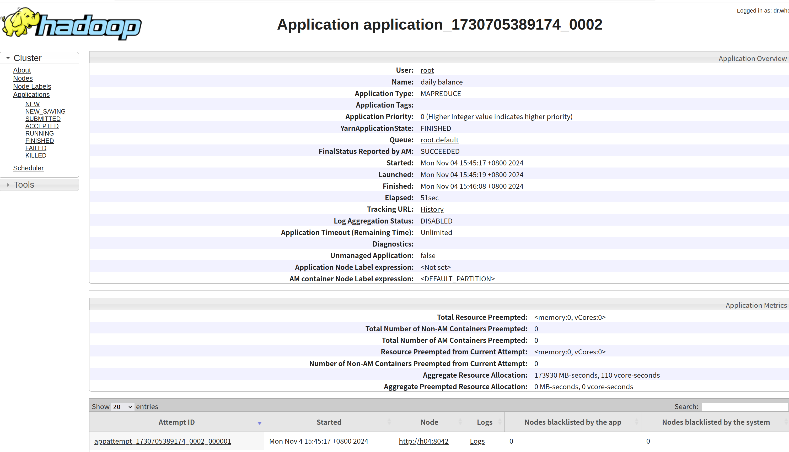
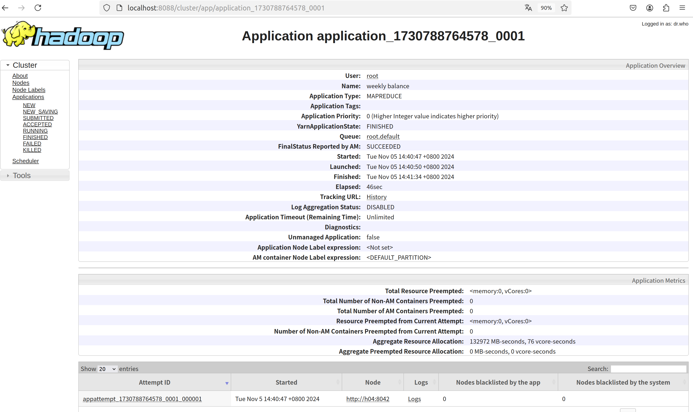
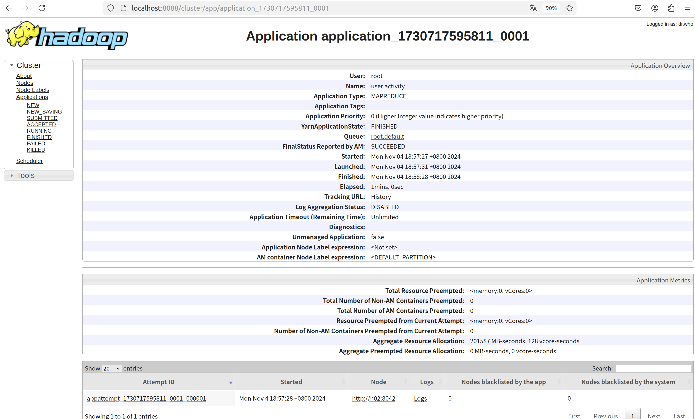
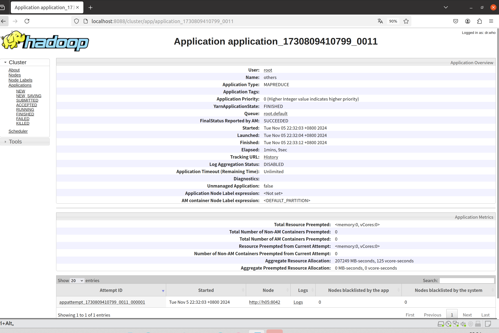

# Hadoop_lab2

## 仓库说明
1. 本仓库文件命名按照`task1,2,3,4`命名，只保留在`docker`上运行的结果和`jar`文件，在`target`文件夹中。本次提交忽略了其他`class`文件。虚拟机本地未进行编译。
2. 输出仍保留一些失败文件，在`output/failed_output`中，其他在`output`中的是成功输出结果。
3. 本次思路仍沿用作业5的单文件运行思路，没有`pom.xml`文件。


## 关键命令
与[作业5](https://github.com/ysw0121/Hadoop_homework)基本相同

## 任务1
根据`user_balance_table`表中的数据，统计所有⽤户每⽇的资⾦流⼊与流出情况。资⾦流⼊意味着申购⾏为，资⾦流出为赎回⾏为。每笔交易的资⾦流⼊和流出量分别由字段`total_purchase_amt`和`total_redeem_amt`表示。数据中的缺失值，将视为零交易。输出格式：`<⽇期> TAB <资⾦流⼊量>,<资⾦流出量>`
### 设计思路
1. Mapper类 (`flowMapper`)：读取输入文件的每一行数据。在在前期实验中发现最后一行出现<br>`report_date	0,0`<br>因此代码中加入了跳过第一行表头行的逻辑判断。接着将每一行的数据按逗号分割成3个字段。分别代表`提取日期`、`购买金额`和`赎回金额`字段，并将空值替换为 "0"。将处理后的数据以`<日期>\t<购买金额>,<赎回金额>`的形式传给`Reducer`。
2. Reducer 类 (`flowReducer`)：接收`Mapper`输出的数据。按日期分组，累加购买金额和赎回金额。将累加结果以`<日期\t总购买金额,总赎回金额>`的形式输出。在实际运行中多次出现`java.lang.NumberFormatException`异常，导致无法输出结果，因此代码中增加了`try-catch`跳过处理。

### 运行结果
运行成功截图如下：

部分输出结果展示如下：
```
20130701	32488348,5525022
20130702	29037390,2554548
20130703	27270770,5953867
20130704	18321185,6410729
...
20140829	267554713,273756380
20140830	199708772,196374134
20140831	275090213,292943033
```

### 可能的改进之处
1. 错误处理：在`flowMapper`中，对输入格式不正确的数据，可以先进行`NumberFormatException`处理，跳过该行数据。
2. 性能优化:如果输入数据量很大，可以考虑使用更高效的数据结构或算法来提高处理速度。比如可以考虑使用 `Combiner`来减少网络传输的数据量。

## 任务2
基于任务1的结果，统计⼀周七天中每天的平均资⾦流⼊与流出情况，并按照资⾦流⼊量从⼤到⼩排序。输出格式：`<weekday> TAB <资⾦流⼊量>,<资⾦流出量>`
### 设计思路
1. Mapper类：`flowMapper`将输入数据按日期转换为星期几，在日期处理上，使用`SimpleDateFormat`将日期字符串解析为`Date`对象。使用`Calendar`类对`Date`处理获取日期所在该周的第`i`天的信息，对`i`在`weekdays`数组中匹配星期的字符串。之后将购买和赎回金额作为值输出。
2. Reducer类：`flowReducer`类接收这些键值对，统计计算每个星期几的购买和赎回金额的总值并最后求平均值，输出结果。
### 运行结果
运行成功截图如下：

输出结果展示如下：
```
Friday	199407923,166467960
Monday	260305810,217463865
Saturday	148088068,112868942
Sunday	155914551,132427205
Thursday	236425594,176466674
Tuesday	263582058,191769144
Wednesday	254162607,194639446
```
### 可能的改进之处
1. 日期格式硬编码：日期格式字符串`"yyyyMMdd"`在代码中硬编码，可以将其提取为一个常量，以便于维护和修改。
2. 平均值计算：在flowReducer中，平均值计算使用了`long`除法，可能会导致精度丢失。因此可以使用浮点数进行计算。
```
double purchase_avg = (double)purchase_sum / cnt;
double redeem_avg = (double)redeem_sum / cnt;
context.write(key, new Text(String.valueOf(purchase_avg) + "," + String.valueOf(redeem_avg)));
```
3. 异常处理：在`flowReducer`中，捕获到`NumberFormatException`时只是打印错误信息，因此可以记录日志或采取其他措施来处理这些异常情况。
4. 代码复用：`weekdays`数组和`SimpleDateFormat`对象可以在类级别共享，避免在每个Mapper实例中重复创建。
## 任务3
根据`user_balance_table`表中的数据，统计每个⽤户的活跃天数，并按照活跃天数降序排列。当⽤户当⽇有直接购买（`direct_purchase_amt`字段⼤于0）或赎回⾏为（`total_redeem_amt`字段⼤于0）时，则该⽤户当天活跃。输出格式：`<⽤户ID> TAB <活跃天数>`
### 设计思路
设计思路
1. Mapper 阶段：与`任务1`处理类似，读取输入数据，跳过第一行标题行，将每一行的数据按逗号分割，提取用户ID、购买金额和兑换金额。如果购买金额或兑换金额为空，则将其设置为"0"。将处理后的数据输出为用户ID和购买金额、兑换金额的组合，传给`Reducer`。
2. Reducer 阶段：按照要求条件，若他们购买金额或者赎回金额有一个大于0，即可记为一次交易，对每个用户统计交易次数。使用一个`HashMap`来存储用户ID和其对应的交易次数。在`cleanup`方法中，将HashMap中的数据按活动次数从高到低排序，并输出结果。最后数据输出不忽略结果0的，没说具体要求统计活跃天数0也可以算在内。

### 运行结果
运行成功截图如下：

部分输出结果展示如下：
```
7629	384
11818	359
21723	334
19140	332
...
24285	0
3621	0
3620	0
3628	0
```

### 可能的改进之处
1. 错误处理：在`Mapper`和`Reducer`中，对输入数据的解析和转换没有进行充分的错误处理。例如，如果输入数据格式不正确，可能会导致`NumberFormatException`。因此可以增加对输入数据的验证和错误处理，提高程序稳定性。
2. 性能优化：在`Reducer`中，使用`HashMap`进行统计，然后在`cleanup`方法中进行排序。如果数据量很大，这可能会导致内存和性能问题。可以使用更高效的数据结构或算法来优化性能，例如使用`Combiner`来减少数据传输量。

## 任务4
⽤户的交易⾏为（如：余额宝或银⾏卡的购买或赎回，⽤户的消费情况等）受到很多因素的影
响。如：⽤户特性（参考⽤户信息表`user_profile_table`），当前利率（参考⽀付宝收益率
表`mfd_day_share_interest`以及银⾏利率表`mfd_bank_shibor`）。现在从上述其他的表中⾃⾏选取研究对象进行统计，根据统计结果（类似于上⾯三个任务的结果）阐述某⼀因素对⽤户交易⾏为的影响。
### 设计思路

### 运行结果
运行成功截图如下：

部分输出结果展示如下：
```

```
### 可能的改进之处
